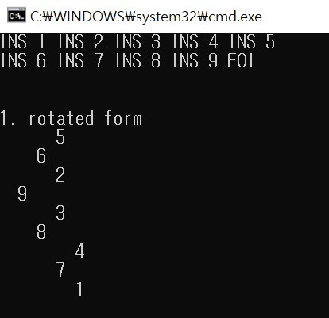
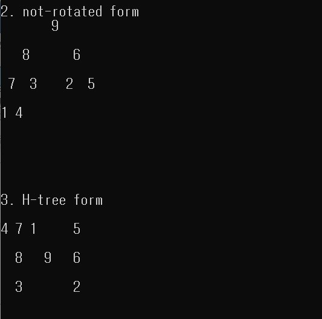

# Max Heap Tree

## Function
1. Print the **rotated heap** in counterclockwise 90 degree.

2. Print the **not-rotated heap.**

3. Print **[H-tree form](https://en.wikipedia.org/wiki/H_tree).** 
            
         
## How to use
1. Only 0~9, uppercase letter, lowercase letter and '?' are allowed to input. 
2. Put a character into the heap with **"INS".**
3. Delete the root node from the heap with **"DEL".**
4. Finish the input with **"EOI".**

## Capture
1. Test 1

2. Test 2

